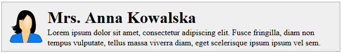

# Nesting &ndash; exercises

### Setup

> Create a fully working environment that will allow you to write JSX files, compile them to JS files and run a working React application.
>
> Remember to:
> - Run ```npm init``` command
> - Install appropriate modules
> - Set Webpack - the first input file should be `js/exercise00.jsx` (then with subsequent exercise numbers), the output `js/out.js`
>
> **Remember to modify appropriately _webpack.config.js_ when doing exercises, so that it points to the file you are currently working on in the _entry_.**

## Exercise done with the lecturer

### Building list of persons  (~ 10min)

In `js/exercise00_02.js`, there is an array with objects representing a person. Import it to `js/exercise00.jsx` e.g. using:

`import people from './exercise00_02';`

Using```.map()``` array method, create based on the array ```div``` elements containing name and surname of a person. Property names of the object can be found in the imported file.

Next, use React to render a ```div``` in an element with the ```app``` id that will display all generated ```divs```.

## Exercises to do on your own

### Exercise 1  (~ 10min - 15min)
#### Data import and structure creation

In `js/exercise01.js`, there is an object representing a person. Import it to `js/exercise01.jsx`, e.g. using:

`import person from './exercise01';`

Modify exercise 2 so that the following structure is created:

```HTML
<div>
    <h1>{ title + name + surname }</h1>
    <span>{ age }</span>
</div>
```

Use React to render a ```div``` in an element with the ```app``` id that will display the title, name, surname, and age of the person according to the structure above. Property names of the object can be found in the imported file.

### Exercise 2  (~ 15min - 20min)
####  Structure change

In `js/exercise_02.js`, there isan array with objects representing people. Import it to `js/app.jsx`, e.g. using:

`import people from './exercise00_02';`

Modify exercise done with the lecturer so that the following structure is created:
```HTML
<div class="person">
    
    <div class="info">
        <h1>{ title + name + surname }</h1>
        <p>{ bio }</p>
    </div>
</div>
 ```

The code above is only a preview. **Remember how the name of the CSS class should be passed in the JSX tags, and remember the appropriate tag closures.**

Property names of the object can be found in the imported file.

As a result, you should get elements similar to the one below:


Next, use React to render a ```div``` in an element with the ```app``` id that will display all generated ```div``` elements.
