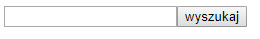
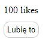

# Podstawy komponentów &ndash; zadania

### Przygotowanie

> Stwórz w pełni działające środowisko, które pozwoli Ci pisać pliki JSX, skompilować je do plików JS i uruchomić działającą aplikację React.
>
> Pamiętaj o:
> - ```npm init```
> - Zainstalowaniu odpowiednich modułów
> - Ustawieniu Webpacka, pierwszym plikiem wejściowym ma być `js/zadanie00.jsx` (potem z kolejnymi numerami zadań), wyjściowym zawsze `js/out.js`
>
> **Pamiętaj, żeby podczas wykonywania zadań modyfikować odpowiednio plik _webpack.config.js_, aby wskazywać plik nad którym obecnie pracujesz w _entry_.**

## Zadanie rozwiązywane z wykładowcą

### Pierwszy komponent  (~ 5min - 10min)

Stwórz komponent wyszukiwarki.

Powinien on posiadać jedno pole tekstowe `input` i obok przycisk `button` "Wyszukaj".

Póki co, komponent ten ma nic więcej nie robić. Wyrenderuj go na stronie.

**Zadanie wykonaj w dwóch wersjach:**
- **Najpierw z komponentem w wersji funkcyjnej**
- **Oraz z tym samym komponentem w wersji zbudowanej z klasy ES6**

**Przykładowy wynik:**

 

## Zadania do samodzielnego wykonania

### Zadanie 1 (~ 5min - 10min)
####  Renderowanie komponentu LikeBox

Stwórz komponent o nazwie `LikeBox`.

Powinien on składać się z licznika polubień oraz przycisku do kliknięcia, że użytkownikowi podoba się dana treść.

Póki co, komponent ten ma nic więcej nie robić. Wyrenderuj go na stronie.

**Zadanie wykonaj w dwóch wersjach:**
- **Najpierw z komponentem w wersji funkcyjnej**
- **Oraz z tym samym komponentem w wersji zbudowanej z klasy ES6**

**Przykładowy wynik:**

 

### Zadanie 2 (~ 5min - 10min)
####  Renderowanie komponentu Menu

Stwórz komponent `Menu`.

Powinien on składać się z pojedynczego elementu listy `ul`, a w niej powinny się pojawić elementy `li` w których będą odpowiednie odnośniki `a`.

Lista: nazwa - odnośnik
- Strona główna - /
- Blog - /blog
- Cennik - /pricing
- Kontakt - /contact

Wyrenderuj komponent na stronie.

**Zadanie wykonaj w dwóch wersjach:**
- **Najpierw komponentem w wersji funkcyjnej**
- **Oraz tym samym komponentem w wersji zbudowanej z klasy ES6**
