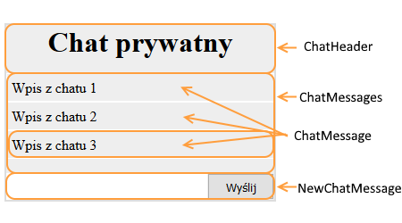

# Composition &ndash; exercises

### Setup

> Create a fully working environment that will allow you to write JSX files, compile them to JS files and run a working React application.
>
> Remember to:
> - Run ```npm init``` command
> - Install appropriate modules
> - Set Webpack - the first input file should be `js/exercise00.jsx` (then with subsequent exercise numbers), the output `js/out.js`
>
> **Remember to modify appropriately _webpack.config.js_ when doing exercises, so that it points to the file you are currently working on in the _entry_.**

## Exercise done with the lecturer

### Dividing into components (~ 10min - 15min)

Create a component named `ShopItem` with appropriate `props` that will be explained later in this exercise. The component should have the following structure:
```HTML
<div>
    <div>
        <h1>{title from props}</h1>
        
    </div>
    <article>
        <p>{description from props}</p>
    </article>
    <div>
        Price: {price from props}
        <button>Kup!</button>
    </div>
</div>
```

Next, divide it into 4 components:
- `ShopItemHeader`
- `ShopItemDescription`
- `ShopItemPricing`
- `ShopItem` that will have the base structure and will use the components above.

Render the `ShopItem` component on the page, passing sample data in attributes to the props.

**Remember to create a main `App` component as well, and to use components from the exercise in it. Render the main `App` component on the page.**

**Do this exercise with class components only.**

## Exercises to do on your own

### Exercise 1  (~ 15min)
#### ShopList component - composition

Use the exercise done with the lecturer.

Create a component named `ShopList`. It should take an array with shopping cart elements in the `props`.

Object should have the following form:

```JavaScript
{
    title   :   'item name',
    image   :   'url_for_item_image'
}
```

In a div with the `shoplist` class it should display only `ShopItemHeader` components with appropriate data. Use `array.map()`.

Render the component on the page, passing as an attribute to props the following `menu` attribute:
```JavaScript
[
    {
        title   :   'Computer mouse',
        image   :   'https://upload.wikimedia.org/wikipedia/commons/c/c5/Red_computer_mouse.jpg'
    },
    {
        title   :   'Keyboard',
        image   :   'https://upload.wikimedia.org/wikipedia/commons/thumb/6/66/Computer_keyboard_Danish_layout.svg/1000px-Computer_keyboard_Danish_layout.svg.png'
    },
    {
        title   :   'Programmer laptop',
        image   :   'https://upload.wikimedia.org/wikipedia/commons/thumb/b/b9/Typing_computer_screen_reflection.jpg/640px-Typing_computer_screen_reflection.jpg'
    }
]
```
**Remember to create a main `App` component as well, and to use components from the exercise in it. Render the main `App` component on the page.**

**Do this exercise with class components only.**

### Exercise 2 (~ 10min - 15min)
#### Chat component - composition

In `js/exercise02.jsx` there is a Chat component. Divide it according to the following scheme:

 

 **Do the exercise two ways:**
 - **with a function component first**
 - **with a class component (the same component but built with a ES6 class**


### Exercise 3 (~ 10min - 15min)
####  Message component and Button component

Create a component named `Button` that contains a `button`. Through propr, it will take the `text` attribute that will be displayed on the button.

Create a component named `Message` that contains two `Button` components (one with the text "Yes", the other with "No"), and a message in a `p` element. The component will take the message through props as `messageText`.

Next, using the components you already made, build the **main `App` component** that will render a page with two messages (with any text you want), a "Log in" button, and a "Register" button. The way of arranging is up to you.

**Do the exercise two ways:**
- **with a function component first**
- **with a class component (the same component but built with a ES6 class**
