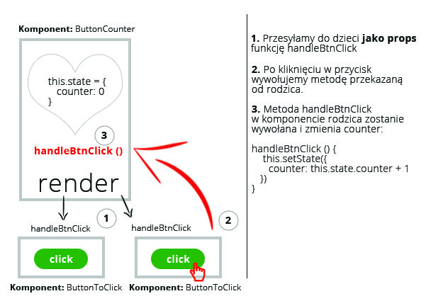

# Passing events &ndash; exercises

### Setup

> Create a fully working environment that will allow you to write JSX files, compile them to JS files and run a working React application.
>
> Remember to:
> - Run ```npm init``` command
> - Install appropriate modules
> - Set Webpack - the first input file should be `js/exercise00.jsx` (then with subsequent exercise numbers), the output `js/out.js`
>
> **Remember to modify appropriately _webpack.config.js_ when doing exercises, so that it points to the file you are currently working on in the _entry_.**


## Exercise done with the lecturer

### Count clicks (~ 15min)

Create components named `ButtonCounter` and `ButtonToClick`.

`ButtonCounter` component displays a `div` with `h1` and two buttons created with the use of `ButtonToClick` component. `h1` should display 0 at the beginning - the target displayed content will be the total number of times the buttons have been clicked.

`ButtonToClick` component contains a `button` that, when clicked, sends an appropriate message to callback that is taken from `onClick` attribute from props. **Do not forget to check if this attribute has been properly transferred and if it is a function.**

Render and test your component.

The diagram below illustrates how the process of passing a function should look more or less, and where it is called. This is just an illustration drawing, helping to understand the whole process.



**Remember to create a main `App` component as well, and to use components from the exercise in it. Render the main `App` component on the page.**


## Exercises to do on your own

### Exercise 1 (~ 5min - 10min)
#### Passing parameters to event function

Create a componrnt with an `a`. When the button is clicked, call the ```handleClickButton()``` method and pass it any string as a parameter. The ```handleClickButton()``` method should write the passed text in the console.

Render and test your component.

Additionally, prevent default button action. You mut pass two parameters to the ```handleClickButton()``` method:
1 - random string,
2 - event.
Preventing default action is: event.preventDefault().

**Remember to create a main `App` component as well, and to use components from the exercise in it. Render the main `App` component on the page.**


### Exercise 2 (~ 15min - 20min)
#### Shopping list

Create components named `Shop` and `ShopItem`.

`ShopItem` contains a `div`with `h1` whose contents are extracted from props `title`. In the `div`, there is a button as well with the text "Buy". When it is clicked, an appropriate message is sent to callback that is taken from props `onBuy`.  **Do not forget to check if this attribute has been properly transferred and if it is a function.** The callback call should be made after the parameter taken from the title given in props (`title`).

 `Shop` should have the following structure:

 ```JSX
    <div>
        <ShopItem title="socks" />
        <ShopItem title="shirt" />
        <ShopItem title="stockings" />
        <ul>
            {list}
        </ul>           
    </div>        
 ```

Instead of `list`, a list of `li` elements should appear, with listed elements that the user marked clicking "Buy".

Render and test your component. Can you see any errors in the console?
If you still have any problems understanding how events are passed to child components, try to draw them and their relations, just like in the first example.

**Remember to create a main `App` component as well, and to use components from the exercise in it. Render the main `App` component on the page.**
